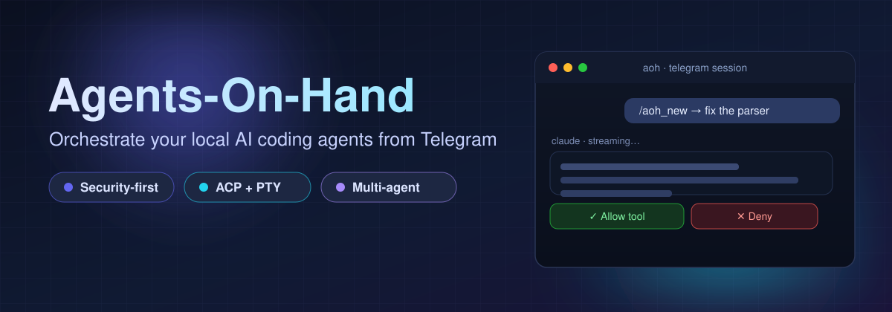
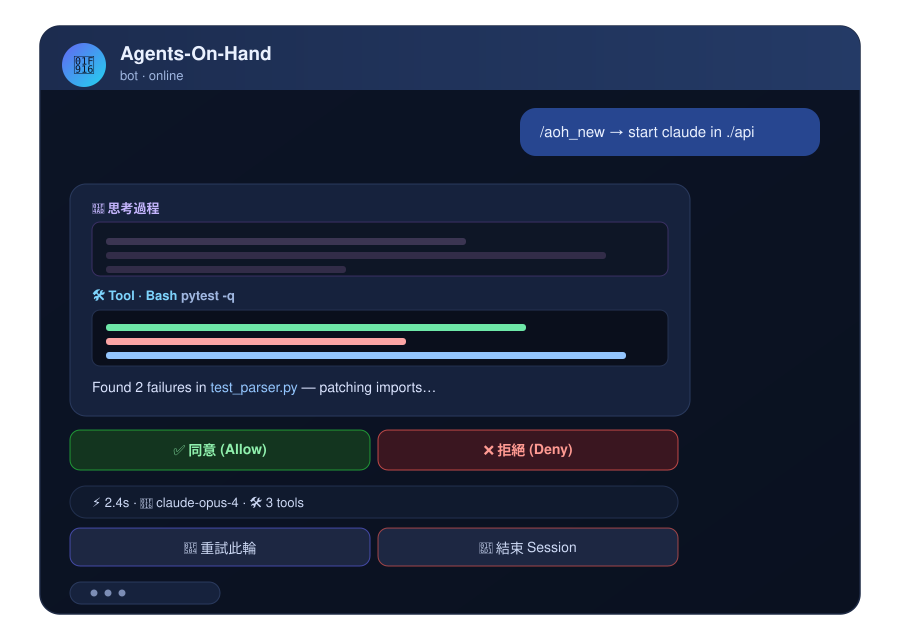
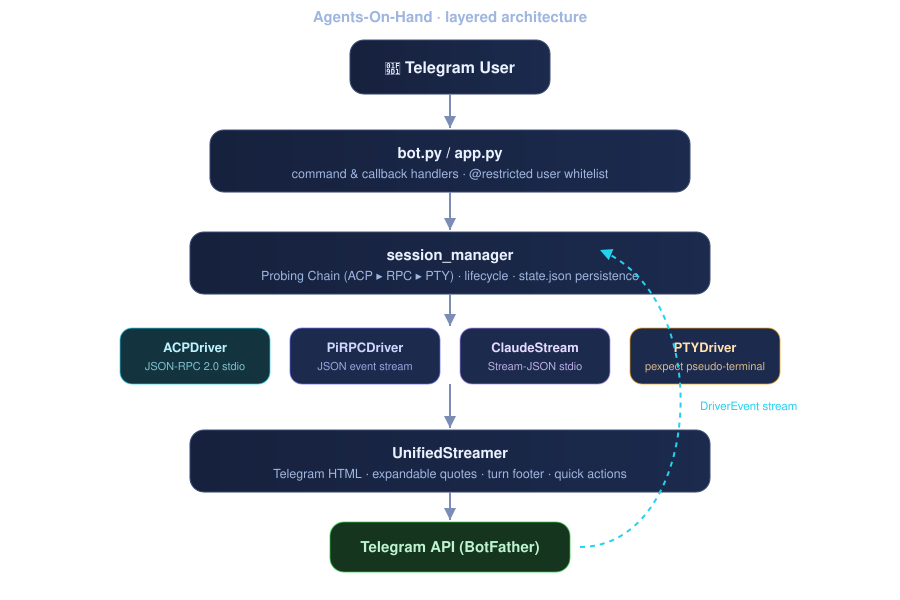
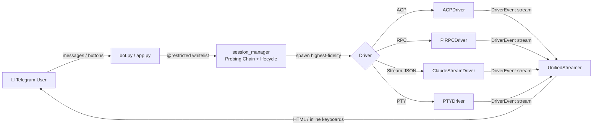

<p align="center">
  
</p>

<p align="center">
  <a href="https://github.com/dimx9173/Agents-On-Hand/actions/workflows/test.yml"></a>
  
  
  
  
  
  <a href="LICENSE"></a>
  
</p>

<p align="center">
  <b>Your personal AI-agent orchestrator in Telegram.</b><br>
  Drive Claude Code, OpenCode, OMP, Pi, Codex, Prime Agent and Bash from chat — securely, with streaming output and one-tap controls.
</p>

---

## ✨ What is Agents-On-Hand?

**Agents-On-Hand (AOH)** is a lightweight, security-first Telegram bot that turns your chat into a control surface for the local CLI AI agents already on your machine. It speaks the highest-fidelity protocol each agent supports — **ACP (JSON-RPC 2.0)**, **native RPC**, or a **PTY fallback** — and renders the agent's output back into Telegram with proper formatting, expandable reasoning traces, tool-approval buttons, and per-turn stats.

- 🔒 **Secure by default** — Telegram user-ID whitelist + directory sandboxing, no secrets in logs.
- ⚡ **Multi-protocol engine** — a *Probing Chain* (ACP ▸ RPC ▸ PTY) auto-selects the best driver per agent.
- 💬 **Telegram-native UX** — typing indicator, expandable `<blockquote>` thinking/tool logs, syntax-highlighted code, crash-restart buttons.
- 🤖 **Multi-session** — run several agents concurrently and switch between them from one chat.
- 🧩 **Zero lock-in** — just a Python script plus the agents you already have installed.

## 📸 Interface

<p align="center">
  
</p>

> A live session: streamed agent output, an expandable reasoning trace, a tool-approval inline keyboard, a per-turn stats footer, and quick-action buttons — all rendered natively in Telegram HTML.

## ✨ Features

| Feature | Description |
|---|---|
| **Direct Chat Mode** | Any non-`/aoh_` message is forwarded straight to your active CLI agent — chat naturally. |
| **ACP + PTY Hybrid** | ACP agents (`omp`, `opencode`, `prime`) use JSON-RPC 2.0 over stdio; everything else falls back to PTY. |
| **Probing Chain** | Per-agent driver chain (`acp` ▸ `pi_rpc` ▸ `pty`) guarantees the highest-fidelity transport. |
| **Typing Indicator** | Top-bar "typing…" while the agent is working. |
| **Crash Notifications** | Instant alert + `[🔄 Restart]` button when an agent process exits. |
| **Dynamic Agent Detection** | Only locally installed agents appear in the selector menu. |
| **Tool Approval Buttons** | `[✅ 同意]` / `[❌ 拒絕]` for ACP permission requests. |
| **Telegram HTML Rendering** | Expandable blockquotes for thinking & tool logs, syntax-highlighted code, tag-balanced streaming — no formatting breakage. |
| **Turn Stats & Actions** | Duration, model name, tool count, plus `[🔄 重試此輪]` / `[🛑 結束 Session]` quick buttons. |
| **Multi-Session** | Run multiple agents at once; switch, view logs, or kill sessions. |
| **Security First** | User-ID whitelist + directory sandboxing + secret redaction in logs. |
| **Interrupt Controls** | `/aoh_esc`, `/aoh_ctrlc`, or type `esc` / `ctrlc` in chat. |

## 🚀 Quick Start

### Prerequisites

- Python **3.10+**
- A Telegram account and a bot token from [@BotFather](https://t.me/BotFather)
- One or more supported CLI agents installed locally (see [Supported Agents](#supported-agents))

### 1. Clone & install

```bash
git clone https://github.com/dimx9173/Agents-On-Hand.git
cd Agents-On-Hand
pip install -r requirements.txt
```

### 2. Configure

```bash
cp .env.example .env
```

Edit `.env` (see [Configuration](#configuration) for every option):

```env
TELEGRAM_BOT_TOKEN=123456789:ABCdef...
ALLOWED_TELEGRAM_USER_IDS=12345678
ALLOWED_ROOT_DIRS=/Users/yourname/projects
SESSION_LOG_DIR=~/.agents-on-hand/sessions
```

### 3. Run

```bash
python main.py
```

Then open a chat with your bot and send `/aoh_new` to pick a directory and an agent. 🎉

## ⚙️ Configuration

All settings live in `.env` (loaded via `python-dotenv`):

| Variable | Required | Default | Description |
|---|---|---|---|
| `TELEGRAM_BOT_TOKEN` | ✅ | — | Bot token from [@BotFather](https://t.me/BotFather). |
| `ALLOWED_TELEGRAM_USER_IDS` | ✅ | — | Comma-separated Telegram user IDs permitted to use the bot. |
| `ALLOWED_ROOT_DIRS` | ⬜ | current dir | Comma-separated root paths the bot may navigate and run agents in (sandbox). |
| `SESSION_LOG_DIR` | ⬜ | `~/.agents-on-hand/sessions` | Where per-session transcript logs are written. |
| `SESSION_STATE_FILE` | ⬜ | `<SESSION_LOG_DIR>/../state.json` | Atomic JSON persistence of session state. |
| `AOH_DEV_ALLOW_ALL_USERS` | ⬜ | `0` | Set to `1` to bypass the whitelist (dev only — never in production). |

> 💡 Your bot token and user IDs are never written to logs (a sanitizing filter redacts them).

## 💬 Commands

| Command | Description |
|---|---|
| `/aoh_new` | Open the directory browser → select a CLI agent to start a session. |
| `/aoh_sessions` | List, switch, view logs, or kill sessions. |
| `/aoh_stop` | Terminate the current active session. |
| `/aoh_esc` | Send `ESC` to the active session. |
| `/aoh_ctrlc` | Send `Ctrl+C` to the active session. |
| `/aoh_help` | Show help + agent installation status. |

**Direct input** — any other text or slash command (e.g. `/commit`, `/clear`) is forwarded directly to the active CLI agent.

## 🤖 Supported Agents

The bot detects which agents are installed and only shows those. Each agent has a *driver chain*; the first available protocol wins.

| Agent | Best protocol | Driver chain | Install |
|---|---|---|---|
| [OMP (Oh My Pi)](https://omp.dev) | ACP | `acp` → `pty` | `npm i -g oh-my-pi` |
| [OpenCode](https://opencode.ai) | ACP | `acp` → `pty` | `npm i -g opencode-ai` |
| [Prime Agent](https://primeintellect.ai) | ACP | `acp` → `pi_rpc` → `pty` | `pip install prime-agent` |
| [Pi Agent](https://pi.dev) | Native RPC | `pi_rpc` → `pty` | `npm i -g pi-agent` |
| [Claude Code](https://claude.ai/code) | Stream-JSON | `claude_stream` → `pty` | `npm i -g @anthropic-ai/claude-code` |
| [Codex CLI](https://github.com/openai/codex) | PTY | `pty` | `npm i -g @openai/codex` |
| Bash | PTY | `pty` | Built-in |

## 🏗️ Architecture

<p align="center">
  
</p>

All protocol drivers emit a normalized `DriverEvent` stream that `UnifiedStreamer` renders into Telegram:



**Unified event types:** `TEXT_DELTA` · `THOUGHT_DELTA` (rendered as expandable 💭 thinking) · `TOOL_REQUEST` (approval keyboard) · `TOOL_RESULT` (expandable 🛠️ block) · `TURN_END` (stats footer + quick actions) · `EXIT`.

**Key modules** (see [`docs/ARCHITECTURE.md`](docs/ARCHITECTURE.md) for the full design):

| Module | Responsibility |
|---|---|
| `app.py` / `bot.py` | Telegram `Application` wiring, handlers, error handling, post-init greeting. |
| `config.py` | Settings, `AVAILABLE_CLI_AGENTS` probing chains, whitelist + path-sandbox validation. |
| `session_manager.py` | `AgentSession` registry, Probing Chain, lifecycle, retries, persistence. |
| `stream_handler.py` | `UnifiedStreamer`: Telegram HTML, expandable quotes, turn footers, action keyboards. |
| `drivers/` | Multi-protocol drivers: `base`, `acp`, `pi_rpc`, `claude_stream`, `pty`. |
| `handlers/` | Telegram handlers: `chat` (routing/interrupts), `restart` (crash alerts), `acp_permissions`. |
| `ui/` | `directory_browser` (paged picker), `session_menu` (switch/logs/kill/retry). |
| `security.py` | `@restricted` decorator enforcing the Telegram user whitelist. |
| `ansi_cleaner.py` | ANSI cleaner, Markdown→Telegram-HTML, tag-stack splitter & auto-balancer. |
| `logging_setup.py` | Rotating log, colored console, secret-redaction filter. |

## 🧪 Development & Testing

```bash
pip install -r requirements.txt
pip install -r requirements-dev.txt
python -m pytest tests/ -v --cov=agents_on_hand
```

- **190+ tests** across the ACP engine, every protocol driver (ACP / Pi RPC / Claude Stream / PTY), streaming completeness, session lifecycle, directory browser, security (whitelist + path sandbox), and output formatting.
- Lint & type-check in CI: `ruff check .` and `mypy agents_on_hand`.
- Coverage gate configured in `pyproject.toml` (`fail_under`).

## 🔒 Security Model

- **User-ID whitelist** — `ALLOWED_TELEGRAM_USER_IDS` restricts the bot to authorized Telegram users.
- **Directory sandboxing** — `ALLOWED_ROOT_DIRS` confines filesystem navigation to configured roots (re-checked on every spawn).
- **No secret logging** — tokens and user IDs are redacted before reaching any log handler.
- **Fail-closed path resolution** — unknown/evicted path tokens resolve to `None` and alert the user rather than acting on a bogus path.

## 🗺️ Roadmap

Highlights from the changelog (see [`CHANGELOG.md`](CHANGELOG.md)):

- Turn-completion events (`TURN_END`) standardized across all drivers, with background completion notifications for multi-agent sessions.
- Centralized logging with rotating files, colored console, and a security sanitizer.
- ACP stdio buffer-overrun recovery and per-turn streaming messages.
- Scoped ACP tool-permission callbacks with backward-compatible fallback.

## 🤝 Contributing

PRs are welcome! See [`CONTRIBUTING.md`](CONTRIBUTING.md) for setup, branch naming, and style guidelines. Please add or update tests for any new behaviour and never commit `.env` or tokens.

## 📄 License

Released under the [Apache License 2.0](LICENSE).
